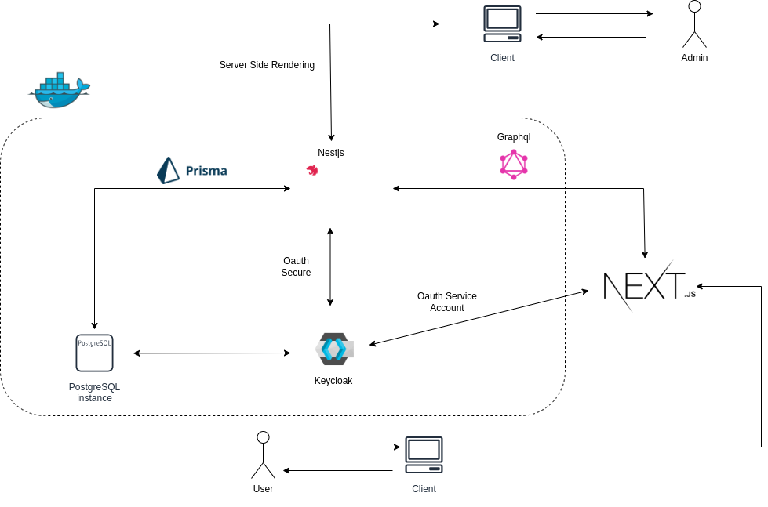
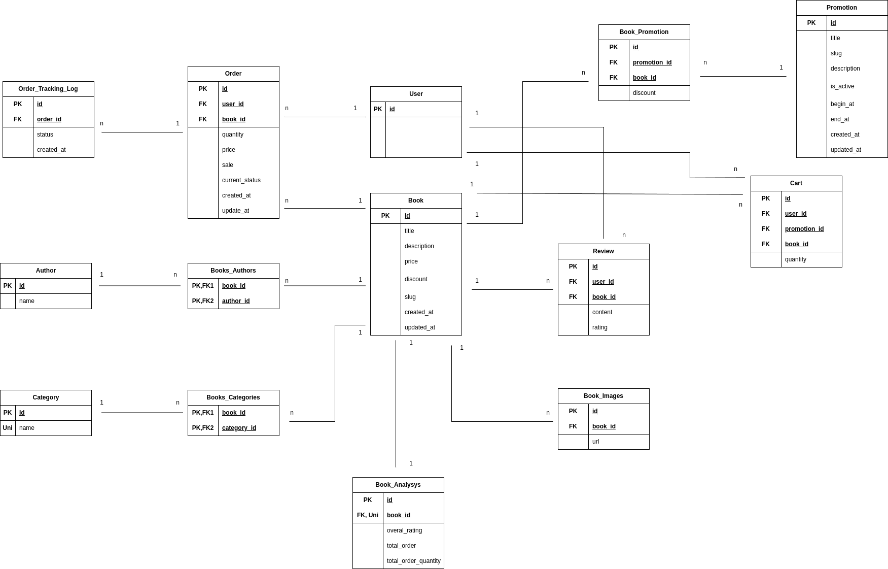

# Bookworm

## System

  

## Database

  

## How to run

### Frontend
1. Look for env/frontend.example.env file
2. Replace your setting
3. Rename to .env and place it to frontend folder
4. Open frontend folder and run
<code>
  npm install
  npm run dev
</code>

### Backend
1. Install docker
2. Look for env/backend.examle.env file and config environment in docker-compose.yml file
3. Run
<code>
  docker compose up
</code>